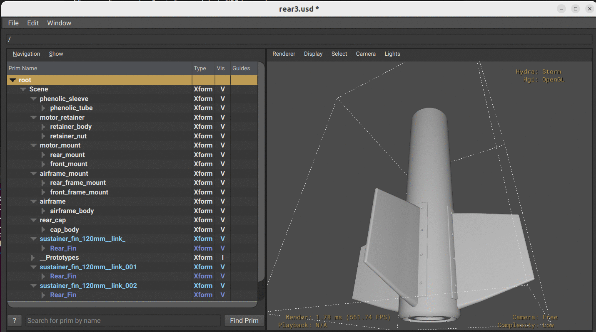

# FreeCAD USD Exporter

FreeCAD-USD-Exporter is a simple plugin that lets you export FreeCAD models to
[Universal Scene Description (USD)](https://openusd.org/) files (`.usd`, `.usda`).

It is intended for workflows where you model in FreeCAD and then inspect,
render, or simulate the scene in tools like `usdview`, Omniverse, or other USD-based DCCs.

---

## Features

- Export the **active FreeCAD document** or **selected objects** to USD
- Supports ASCII (`.usda`) or binary (`.usd`) files (depending on your implementation)
- Keeps hierarchical structure that mirrors FreeCAD objects
- Supports the following FreeCAD features:
  - Native FreeCAD **parametric shapes**
  - **Meshes**
  - **Clones**
  - **Links**

---

## Requirements

- **FreeCAD** 0.20+ (Python 3 builds)
- **Python USD bindings** (`pxr`):
```bash
python3 -c "from pxr import Usd, UsdGeom; print('USD ok')"
```
  
## Installation
1. Find your FreeCAD user Mod directory

FreeCAD looks for workbenches and plugins under a user-specific Mod directory:

Linux
```bash
~/.FreeCAD/Mod
```
or
```bash
~/.local/share/FreeCAD/Mod
```

macOS
```bash
~/Library/Preferences/FreeCAD/Mod
```

Windows
```bash
%APPDATA%\FreeCAD\Mod
```

You can also check Edit → Preferences → General → Application → Paths in FreeCAD.

2. Copy / clone the exporter

Create a folder for the exporter inside Mod, for example:
```bash
~/.FreeCAD/Mod/FreeCAD_USD_Exporter/
```

Put your plugin files there, e.g.:
```
FreeCAD_USD_Exporter/
  ├── Init.py
  ├── InitGui.py        # if you add toolbar / menu command
  ├── UsdExporter.py    # main exporter implementation
  └── README.md
```

If this repository is hosted on Git, you can clone directly:

```bash
cd ~/.FreeCAD/Mod
git clone https://github.com/<your-user>/freecad-usd-exporter.git FreeCAD_USD_Exporter
```

Restart FreeCAD after installing the plug-in.

## Usage

1. Open or create a document in FreeCAD.
2. Select the objects you want to export (or nothing to export the whole document).
3. Go to File → Export…
4. In the file type dropdown, choose “USD (*.usd *.usda)”.
5. Pick a file name (e.g. my_model.usda) and save.

## Load your USD

Open the resulting file in usdview:
```bash
usdview my_model.usda
```



---

## Architecture

The exporter is organized into focused modules with clear responsibilities:

```
freecad2usd/
├── __init__.py          # Package marker
├── Init.py              # FreeCAD export format registration
├── InitGui.py           # FreeCAD workbench (minimal)
├── UsdExporter.py       # Main entry point, BFS traversal
├── Registry.py          # Type handler registry + exporters
├── Prototypes.py        # USD instancing/prototype management
├── Materials.py         # Material extraction + UsdPreviewSurface
└── Geometry.py          # Mesh tessellation + normal computation
```

### Module Responsibilities

| Module | Lines | Purpose |
|--------|-------|---------|
| `UsdExporter.py` | ~290 | `export()` entry point, BFS traversal loop, ExportContext |
| `Registry.py` | ~220 | `@exporter` decorator, handler lookup, all type-specific handlers |
| `Prototypes.py` | ~120 | Prototype cache, `ensure_prototype()`, `make_instance()` |
| `Materials.py` | ~140 | Extract FreeCAD colors, create `UsdPreviewSurface` shaders |
| `Geometry.py` | ~230 | Tessellate shapes, compute smoothed normals, create USD meshes |

### Dependency Graph

```
UsdExporter
    ├── Registry      (find_handler, type exporters)
    ├── Prototypes    (ensure_prototype, make_instance)
    └── Materials     (extract_material_properties, ensure_material)

Registry
    ├── Geometry      (tessellate_shape_to_usd, mesh_to_usd)
    └── Prototypes    (make_instance)

Prototypes, Materials, Geometry → standalone (no internal dependencies)
```

### Adding New Type Handlers

To support a new FreeCAD object type, add a handler to `Registry.py`:

```python
@exporter("My::CustomType", priority=75)
def _export_custom(obj, ctx, this_xform, child_global, usd_material) -> bool:
    """Export My::CustomType objects."""
    if hasattr(obj, "Shape") and not obj.Shape.isNull():
        mesh_name = _make_usd_safe(obj.Label) + "_mesh"
        Geometry.tessellate_shape_to_usd(
            obj.Shape, ctx.stage, this_xform, mesh_name,
            tess_tolerance=0.1,
            angle_threshold=10.0,
            unbake_to_local=UNBAKE_POINTS_TO_LOCAL,
            global_placement=child_global,
            material=usd_material,
        )
    return True  # True = recurse into children, False = stop here
```

Handler priority determines evaluation order (higher = checked first). The handler returns `True` to continue traversing children or `False` to stop at this node.

### Key Design Decisions

- **BFS traversal** instead of recursion — avoids stack overflow on deep hierarchies
- **Handler registry** with decorator — extensible without modifying core loop
- **Callback-based prototypes** — avoids circular imports between modules
- **ExportContext dataclass** — clean parameter passing to handlers
- **Separate caches** for prototypes and materials — cleared per-export session

